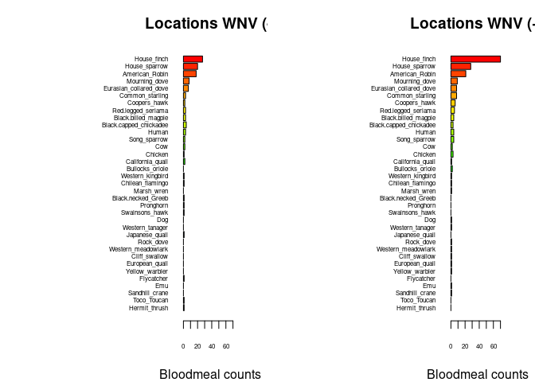
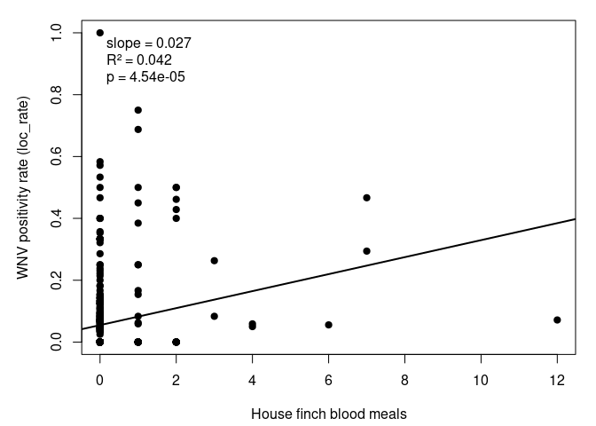

Warm-up mini-Report: Mosquito Blood Hosts in Salt Lake City, Utah
================
Peyton Wells
2025-10-07

- [ABSTRACT](#abstract)
- [BACKGROUND](#background)
- [STUDY QUESTION and HYPOTHESIS](#study-question-and-hypothesis)
  - [Questions](#questions)
  - [Hypothesis](#hypothesis)
  - [Prediction](#prediction)
- [METHODS](#methods)
  - [Fill in 1st analysis
    e.g. barplots](#fill-in-1st-analysis-eg-barplots)
  - [Fill in 2nd analysis/plot e.g. generalized linear
    model](#fill-in-2nd-analysisplot-eg-generalized-linear-model)
- [DISCUSSION](#discussion)
  - [Interpretation of 1st analysis
    (e.g. barplots)](#interpretation-of-1st-analysis-eg-barplots)
  - [Interpretation of 2nd analysis (e.g. generalized linear
    model)](#interpretation-of-2nd-analysis-eg-generalized-linear-model)
- [CONCLUSION](#conclusion)
- [REFERENCES](#references)

# ABSTRACT

In the first week of class we analyzed blood meal samples for the West
Nile Virus in the greater Salt Lake City, Utah area. Using genetic
sequencing for the host species from mosquito blood meals, we have
studied which bird species are possibly acting as amplifying species for
the West Nile Virus. We have determined that House finches and American
robins were the most common blood meals for these mosquito’s and more
likely to be carrying the virus.

# BACKGROUND

West Nile Virus is the leading cause of mosquito born diseases in the
United States. The virus is usually passed into common amplifying
species or host like birds. The disease can be passed onto humans
causing severe illness in older or vulnerable humans (CDC, 2025).

It is important to know which host species of mosquito’s prefer to help
identify amplification. Mosquito blood meals can be examined using DNA
extraction, PCR, and sequencing with BLAST database. Through previous
research, it has been shown that some species of birds have different
levels of viremia (Komar et al. 2003). Looking at these studies and the
evididence that birds are the main source of West Nile Virus in the
United States (CDC, 2025), this likely suggest that mosquito’s feasting
on birds will have higher virus positive rates.

``` r
# Manually transcribe duration (mean, lo, hi) from the last table column
duration <- data.frame(
  Bird = c("Canada Goose","Mallard", 
           "American Kestrel","Northern Bobwhite",
           "Japanese Quail","Ring-necked Pheasant",
           "American Coot","Killdeer",
           "Ring-billed Gull","Mourning Dove",
           "Rock Dove","Monk Parakeet",
           "Budgerigar","Great Horned Owl",
           "Northern Flicker","Blue Jay",
           "Black-billed Magpie","American Crow",
           "Fish Crow","American Robin",
           "European Starling","Red-winged Blackbird",
           "Common Grackle","House Finch","House Sparrow"),
  mean = c(4.0,4.0,4.5,4.0,1.3,3.7,4.0,4.5,5.5,3.7,3.2,2.7,1.7,6.0,4.0,
           4.0,5.0,3.8,5.0,4.5,3.2,3.0,3.3,6.0,4.5),
  lo   = c(3,4,4,3,0,3,4,4,4,3,3,1,0,6,3,
           3,5,3,4,4,3,3,3,5,2),
  hi   = c(5,4,5,5,4,4,4,5,7,4,4,4,4,6,5,
           5,5,5,7,5,4,3,4,7,6)
)

# Choose some colors
cols <- c(rainbow(30)[c(10:29,1:5)])  # rainbow colors

# horizontal barplot
par(mar=c(5,12,2,2))  # wider left margin for names
bp <- barplot(duration$mean, horiz=TRUE, names.arg=duration$Bird,
              las=1, col=cols, xlab="Days of detectable viremia", xlim=c(0,7))

# add error bars
arrows(duration$lo, bp, duration$hi, bp,
       angle=90, code=3, length=0.05, col="black", xpd=TRUE)
```


# STUDY QUESTION and HYPOTHESIS

## Questions

What is the main ampligying host of the West Nile VIrus in Salt Lake?

## Hypothesis

House finches are the main amplifying host of West Nile in Salt Lake
City, Utah.

## Prediction

Locations with mosquito blood meals from house finches will probably
have high numbers of West Nile Virus positives.

# METHODS

We used a class data set of mosquito blood meals and West Nile Virus
testing from the Salt Lake City area We did two analyses first comparing
the number of mosquito blood meals from each host species between
locations with and without West Nile Virus and the second to test
whether the number of house finch blood meals predicts the positive
transmission of the virus using a linear model.

## Fill in 1st analysis e.g. barplots

We compared the number of mosquito blood meals from each host species
between different locations with positve and nonpositve counts of West
Nile.

``` r
## import counts_matrix: data.frame with column 'loc_positives' (0/1) and host columns 'host_*'
counts_matrix <- read.csv("bloodmeal_plusWNV_for_BIOL3070.csv")

## 1) Identify host columns
host_cols <- grep("^host_", names(counts_matrix), value = TRUE)

if (length(host_cols) == 0) {
  stop("No columns matching '^host_' were found in counts_matrix.")
}

## 2) Ensure loc_positives is present and has both levels 0 and 1 where possible
counts_matrix$loc_positives <- factor(counts_matrix$loc_positives, levels = c(0, 1))

## 3) Aggregate host counts by loc_positives
agg <- stats::aggregate(
  counts_matrix[, host_cols, drop = FALSE],
  by = list(loc_positives = counts_matrix$loc_positives),
  FUN = function(x) sum(as.numeric(x), na.rm = TRUE)
)

## make sure both rows exist; if one is missing, add a zero row
need_levels <- setdiff(levels(counts_matrix$loc_positives), as.character(agg$loc_positives))
if (length(need_levels)) {
  zero_row <- as.list(rep(0, length(host_cols)))
  names(zero_row) <- host_cols
  for (lv in need_levels) {
    agg <- rbind(agg, c(lv, zero_row))
  }
  ## restore proper type
  agg$loc_positives <- factor(agg$loc_positives, levels = c("0","1"))
  ## coerce numeric host cols (they may have become character after rbind)
  for (hc in host_cols) agg[[hc]] <- as.numeric(agg[[hc]])
  agg <- agg[order(agg$loc_positives), , drop = FALSE]
}

## 4) Decide species order (overall abundance, descending)
overall <- colSums(agg[, host_cols, drop = FALSE], na.rm = TRUE)
host_order <- names(sort(overall, decreasing = TRUE))
species_labels <- rev(sub("^host_", "", host_order))  # nicer labels

## 5) Build count vectors for each panel in the SAME order
counts0 <- rev(as.numeric(agg[agg$loc_positives == 0, host_order, drop = TRUE]))
counts1 <- rev(as.numeric(agg[agg$loc_positives == 1, host_order, drop = TRUE]))

## 6) Colors: reuse your existing 'cols' if it exists and is long enough; otherwise generate
if (exists("cols") && length(cols) >= length(host_order)) {
  species_colors <- setNames(cols[seq_along(host_order)], species_labels)
} else {
  species_colors <- setNames(rainbow(length(host_order) + 10)[seq_along(host_order)], species_labels)
}

## 7) Shared x-limit for comparability
xmax <- max(c(counts0, counts1), na.rm = TRUE)
xmax <- if (is.finite(xmax)) xmax else 1
xlim_use <- c(0, xmax * 1.08)

## 8) Plot: two horizontal barplots with identical order and colors
op <- par(mfrow = c(1, 2),
          mar = c(4, 12, 3, 2),  # big left margin for species names
          xaxs = "i")           # a bit tighter axis padding

## Panel A: No WNV detected (loc_positives = 0)
barplot(height = counts0,
        names.arg = species_labels, 
        cex.names = .5,
        cex.axis = .5,
        col = rev(unname(species_colors[species_labels])),
        horiz = TRUE,
        las = 1,
        xlab = "Bloodmeal counts",
        main = "Locations WNV (-)",
        xlim = xlim_use)

## Panel B: WNV detected (loc_positives = 1)
barplot(height = counts1,
        names.arg = species_labels, 
        cex.names = .5,
        cex.axis = .5,
        col = rev(unname(species_colors[species_labels])),
        horiz = TRUE,
        las = 1,
        xlab = "Bloodmeal counts",
        main = "Locations WNV (+)",
        xlim = xlim_use)
```

<!-- -->

``` r
par(op)

## Keep the colors mapping for reuse elsewhere
host_species_colors <- species_colors
```

## Fill in 2nd analysis/plot e.g. generalized linear model

It was tested whehter the presence of house finch blood meals predicts
whether a location was West Nile positve.

``` r
# Assumes 'counts_matrix' already exists from earlier chunk

# Drop rows with missing values for the two variables
d <- subset(counts_matrix, !is.na(loc_rate) & !is.na(host_House_finch))

# Fit linear model
fit <- lm(loc_rate ~ host_House_finch, data = d)
s <- summary(fit)

# Extract stats for annotation
slope  <- coef(s)[2, 1]
pval   <- coef(s)[2, 4]
r2     <- s$r.squared

# Build label text
lab <- sprintf("slope = %.3f\nR² = %.3f\np = %.3g", slope, r2, pval)

# Base plot: points + fitted line + annotation
op <- par(mar = c(4.2, 4.8, 1.2, 1.2))
plot(d$host_House_finch, d$loc_rate,
     pch = 19,
     xlab = "House finch blood meals",
     ylab = "WNV positivity rate (loc_rate)")
abline(fit, lwd = 2)

# Place the annotation in the top-left corner
usr <- par("usr")
xpos <- usr[1] + 0.05 * (usr[2] - usr[1])
ypos <- usr[4] - 0.05 * (usr[4] - usr[3])
text(x = xpos, y = ypos, labels = lab, adj = c(0,1))
```

<!-- -->

``` r
par(op)
```

# DISCUSSION

## Interpretation of 1st analysis (e.g. barplots)

The bar plot shows that House finches, American robins, and House
Sparrows are the most common host species in mosquito blood meals. These
areas also had the most West Nile positive supporting the hypothesis
that these birds are likely amplifying host.

## Interpretation of 2nd analysis (e.g. generalized linear model)

The second analysis showed a linear association between the number of
house finch blood meals and the likelihood of West Nile positive cases.

# CONCLUSION

Our experiment shows that house finches and similar species like
American robins are the main host for mosquitoes in Salt Lake City and
may serve as amplifying host for the West Nile Virus. Keeping an eye on
these species interactions may improve predictions and prevention of the
Virus.

# REFERENCES

1.  Komar N, Langevin S, Hinten S, Nemeth N, Edwards E, Hettler D, Davis
    B, Bowen R, Bunning M. Experimental infection of North American
    birds with the New York 1999 strain of West Nile virus. Emerg Infect
    Dis. 2003 Mar;9(3):311-22. <https://doi.org/10.3201/eid0903.020628>

2.Centers for Disease Control and Prevention (CDC). West Nile Virus:
About. Sept. 10, 2025.
<https://www.cdc.gov/west-nile-virus/about/index.html>

3.  ChatGPT. OpenAI, version Jan 2025. Used as a reference for functions
    such as plot() and to correct syntax errors. Accessed 2025-10-07.
