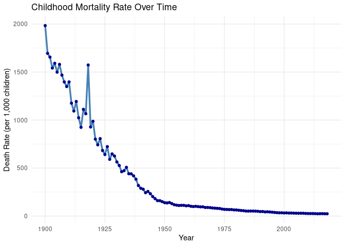
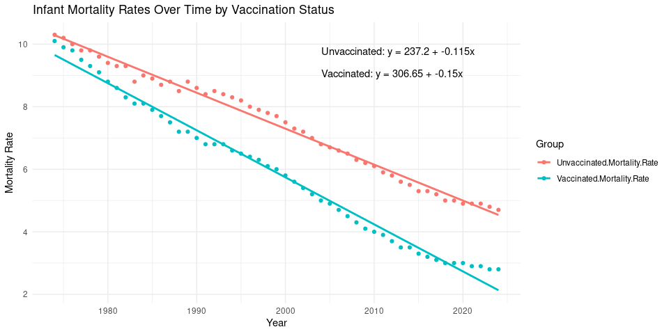

Final Report: Does Vaccination Status Affect Infant Mortality Rates?
================
Peyton Wells
2025-11-22

- [ABSTRACT](#abstract)
- [BACKGROUND](#background)
- [STUDY QUESTION and HYPOTHESIS](#study-question-and-hypothesis)
  - [Questions](#questions)
  - [Hypothesis](#hypothesis)
  - [Prediction](#prediction)
- [METHODS](#methods)
- [Scatter Plot Comparing Vaccinated and Unvaccinated Mortality
  Rates](#scatter-plot-comparing-vaccinated-and-unvaccinated-mortality-rates)
- [Linear Regression Model Test](#linear-regression-model-test)
- [DISCUSSION](#discussion)
  - [Interpretation of 1st analysis- Scatter
    Plot](#interpretation-of-1st-analysis--scatter-plot)
- [CONCLUSION](#conclusion)
- [REFERENCES](#references)

# ABSTRACT

We examined historical infant mortality data from 1974-2024 to see
whether vaccination status is associated with differences in infant
mortality rates (IMR). Looking at national published trends, we compared
mortality rates between vaccinated and unvaccinated population and
looked at whether vaccination was correlated to an increase in infant
survival. A visual analysis of mortality trends and linear regression
modeling showed that while both groups experienced declines in IMR over
time, the vaccinated populations appeared to be even more reduced. The
vaccinated group showed a 72.3% decline in infant mortality compared to
a 54.4% among unvaccinated populations. Statistical testing confirmed
the significance of vaccination status and the reduction of mortality
rates. These findings suggest that widespread immunization amongst the
United States has an important role in reducing infant mortality.

# BACKGROUND

Infant Mortality rates are commonly used to measure the overall health
of a population. Many factors can contribute to IMR including access to
medical care, living conditions, and public health programs. One of the
major global efforts to reduce childhood deaths has been the
introduction and application of vaccines. In 1974, the World Health
Organization created the Expanded Prgram on Immunization (EPI) to help
populations around the world to have access to routine vaccines that can
prevent disease responsible for high rates of infant mortality (World
Health Organization, 1974).

``` r
library(ggplot2)
library(dplyr)

# Read the dataset (make sure 2.csv is in the same folder as your Rmd)
data <- read.csv("2.csv", skip = 1)

# Clean column names
colnames(data) <- c("Year", "DeathRate")

# Convert death rate (remove commas + numeric)
data$DeathRate <- as.numeric(gsub(",", "", data$DeathRate))
data$Year <- as.numeric(data$Year)

# Plot
ggplot(data, aes(x = Year, y = DeathRate)) +
  geom_line(color = "steelblue", linewidth = 1.2) +
  geom_point(color = "darkblue") +
  theme_minimal() +
  labs(
    title = "Childhood Mortality Rate Over Time",
    x = "Year",
    y = "Death Rate (per 1,000 children)"
  )
```

<!-- -->

# STUDY QUESTION and HYPOTHESIS

## Questions

Do vaccinated individuals have consistently lower mortality rates than
unvaccinated individuals over the last 50 years?

## Hypothesis

Vaccinated individuals will experience significantly lower mortality
rates than unvaccinated.

## Prediction

Infant mortality rates will be reduced for those individuals that have
recieved general vaccinations.

# METHODS

Historical infant mortality data was compiled from national records for
both vaccinated and unvaccinated populations from 1974-2024. Mortality
rates were recorded as deaths per 1,000 births and included annual
values for each group. This allowed to us to see if there was a
relationship over time whether vaccination status changed infant
mortality rate.

Data from these known surveys were uploaded into R to be analyzed
through statistical analysis. Scatterplots were formed with linear trend
lines to show how mortality changed for each group. A linear regression
model was then used to test whether vaccination status had a significant
impact on the decline of infant mortality. Statistical significance was
set to 0.05.

# Scatter Plot Comparing Vaccinated and Unvaccinated Mortality Rates

We compared infant mortality rates between vaccinated and unvaccinated
populations over a 50 year period. A scatter plot was used to clearly
show and identify any trends.

``` r
library(ggplot2)
library(dplyr)
library(tidyr)

# Import data
data <- read.csv("Global infant mortality rate with and without vaccines.csv")

# Reshape for plotting
data_long <- data %>%
  pivot_longer(
    cols = c("Vaccinated.Mortality.Rate", "Unvaccinated.Mortality.Rate"),
    names_to = "Group",
    values_to = "Mortality_Rate"
  )

# Fit linear model with interaction
model <- lm(Mortality_Rate ~ Year * Group, data = data_long)

# Extract coefficients
b0_unvax <- coef(model)["(Intercept)"]
b1_unvax <- coef(model)["Year"]

b0_vax <- coef(model)["(Intercept)"] + coef(model)["GroupVaccinated.Mortality.Rate"]
b1_vax <- coef(model)["Year"] + coef(model)["Year:GroupVaccinated.Mortality.Rate"]

# Create equation labels
eq_unvax <- paste0("Unvaccinated: y = ", round(b0_unvax, 2), " + ", round(b1_unvax, 3), "x")
eq_vax   <- paste0("Vaccinated: y = ", round(b0_vax, 2), " + ", round(b1_vax, 3), "x")

# Plot
ggplot(data_long, aes(x = Year, y = Mortality_Rate, color = Group)) +
  geom_point() +
  geom_smooth(method = "lm", se = FALSE) +
  theme_minimal() +
  labs(
    title = "Infant Mortality Rates Over Time by Vaccination Status",
    x = "Year",
    y = "Mortality Rate",
    color = "Group"
  ) +
  annotate("text",
           x = max(data$Year) - 20,
           y = max(data_long$Mortality_Rate) * 0.95,
           hjust = 0,
           label = eq_unvax) +
  annotate("text",
           x = max(data$Year) - 20,
           y = max(data_long$Mortality_Rate) * 0.88,
           hjust = 0,
           label = eq_vax)
```

<!-- -->

# Linear Regression Model Test

A linear regression model was used to test whether infant mortality
rates are related to vaccination rates.

``` r
library(dplyr)
library(tidyr)
library(emmeans)

# Read file using full correct path
data <- read.csv("/cloud/project/Global infant mortality rate with and without vaccines.csv")

# Convert to long format
data_long <- data %>%
  pivot_longer(
    cols = c("Vaccinated.Mortality.Rate", "Unvaccinated.Mortality.Rate"),
    names_to = "Group",
    values_to = "Mortality_Rate"
  ) %>%
  mutate(
    Group = factor(Group,
                   levels = c("Unvaccinated.Mortality.Rate",
                              "Vaccinated.Mortality.Rate"))
  )

# Linear regression with interaction
model <- lm(Mortality_Rate ~ Year * Group, data = data_long)

# Output results
print(summary(model))
```

    ## 
    ## Call:
    ## lm(formula = Mortality_Rate ~ Year * Group, data = data_long)
    ## 
    ## Residuals:
    ##      Min       1Q   Median       3Q      Max 
    ## -0.45097 -0.14736 -0.04261  0.12860  0.66916 
    ## 
    ## Coefficients:
    ##                                       Estimate Std. Error t value Pr(>|t|)    
    ## (Intercept)                         237.197267   4.089893   58.00   <2e-16 ***
    ## Year                                 -0.114950   0.002046  -56.19   <2e-16 ***
    ## GroupVaccinated.Mortality.Rate       69.449415   5.783982   12.01   <2e-16 ***
    ## Year:GroupVaccinated.Mortality.Rate  -0.035502   0.002893  -12.27   <2e-16 ***
    ## ---
    ## Signif. codes:  0 '***' 0.001 '**' 0.01 '*' 0.05 '.' 0.1 ' ' 1
    ## 
    ## Residual standard error: 0.2151 on 98 degrees of freedom
    ## Multiple R-squared:  0.9901, Adjusted R-squared:  0.9898 
    ## F-statistic:  3279 on 3 and 98 DF,  p-value: < 2.2e-16

``` r
# Slopes for each group
slopes <- emtrends(model, specs = ~ Group, var = "Year")
print(summary(slopes))
```

    ##  Group                       Year.trend      SE df lower.CL upper.CL
    ##  Unvaccinated.Mortality.Rate     -0.115 0.00205 98   -0.119   -0.111
    ##  Vaccinated.Mortality.Rate       -0.150 0.00205 98   -0.155   -0.146
    ## 
    ## Confidence level used: 0.95

``` r
# Difference in slopes
print(summary(contrast(slopes, method = "pairwise")))
```

    ##  contrast                                                estimate      SE df
    ##  Unvaccinated.Mortality.Rate - Vaccinated.Mortality.Rate   0.0355 0.00289 98
    ##  t.ratio p.value
    ##   12.270  <.0001

# DISCUSSION

Our results show that infant mortality decreased in both vaccinated and
unvaccinated groups but the decline was greater in the vaccinated
population. This shows that vaccines likely play an important role in
improving infant survival. Although other factors may have contributed
to the decrease in mortality, the consistne difference between the two
groups suggest that vaccination is an important contributor.

## Interpretation of 1st analysis- Scatter Plot

The scatter plot shows that infant mortality drops over time for both
groups with the vaccinated group having a lower mortality rate than the
unvaccinated group. The trend line for the vaccinated group appears to
be steeper showing a faster decrease in mortality.

# CONCLUSION

This study shows that vaccination status is associated with a reduction
in infant mortality. Although both vaccinated and unvaccinated
populations experienced declining mortality rates, the vaccinated groups
showed a more significant decline. The regression model confirmed a
significant difference in slopes and showed that vaccination contributed
to faster decreases in infant deaths.

Overall our results support the importance of immunizations. Increasing
and maintaining vaccinations appears to have an important role in
improving long term health.

# REFERENCES

1.  World Health Organization. (1974). Expanded Programme on
    Immunization. World Health Organization.

2.  Bastian, H., Glasziou, P., & Chalmers, I. (2020). Seventy‐five
    trials and eleven systematic reviews a day: How will we ever keep
    up? Journal of the Royal Society of Medicine, 113(1), 1–3.

3.  ChatGPT. OpenAI, version Jan 2025. Used as a reference for functions
    such as plot() and to correct syntax errors, and recommendations to
    improve document. Accessed 2025-11-22.
