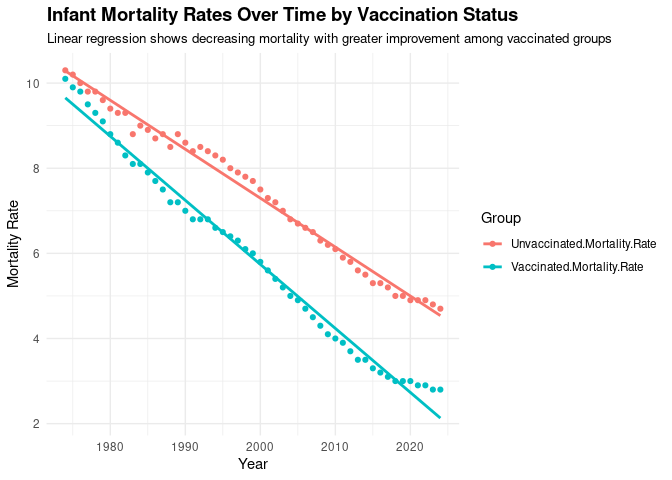

Warm-up mini-Report: Mosquito Blood Hosts in Salt Lake City, Utah
================
Peyton Wells
2025-10-30

- [ABSTRACT](#abstract)
- [BACKGROUND](#background)
- [STUDY QUESTION and HYPOTHESIS](#study-question-and-hypothesis)
  - [Questions](#questions)
  - [Hypothesis](#hypothesis)
  - [Prediction](#prediction)
- [METHODS](#methods)
  - [Bar Plot Comparing Blood Meals and Virus
    Positive](#bar-plot-comparing-blood-meals-and-virus-positive)
  - [General Linear Model Comparing House Finch Blood Meals and West
    Nile Virus
    Positive](#general-linear-model-comparing-house-finch-blood-meals-and-west-nile-virus-positive)
- [DISCUSSION](#discussion)
  - [Interpretation of 1st analysis-
    Barplot](#interpretation-of-1st-analysis--barplot)
  - [Interpretation of 2nd analysis- Generalized Linear
    Model](#interpretation-of-2nd-analysis--generalized-linear-model)
- [CONCLUSION](#conclusion)
- [REFERENCES](#references)

Homework 10 Code Chunk

``` r
# Load libraries
library(ggplot2)
library(dplyr)
library(tidyr)

# Import your CSV file
data <- read.csv("Global infant mortality rate with and without vaccines.csv")

# Reshape into long format for regression and plotting
data_long <- data %>%
  pivot_longer(cols = c("Vaccinated.Mortality.Rate", "Unvaccinated.Mortality.Rate"),
               names_to = "Group",
               values_to = "Mortality_Rate")

# Linear regression model: Mortality Rate ~ Year * Group
model <- lm(Mortality_Rate ~ Year * Group, data = data_long)
summary(model)
```

    ## 
    ## Call:
    ## lm(formula = Mortality_Rate ~ Year * Group, data = data_long)
    ## 
    ## Residuals:
    ##      Min       1Q   Median       3Q      Max 
    ## -0.45097 -0.14736 -0.04261  0.12860  0.66916 
    ## 
    ## Coefficients:
    ##                                       Estimate Std. Error t value Pr(>|t|)    
    ## (Intercept)                         237.197267   4.089893   58.00   <2e-16 ***
    ## Year                                 -0.114950   0.002046  -56.19   <2e-16 ***
    ## GroupVaccinated.Mortality.Rate       69.449415   5.783982   12.01   <2e-16 ***
    ## Year:GroupVaccinated.Mortality.Rate  -0.035502   0.002893  -12.27   <2e-16 ***
    ## ---
    ## Signif. codes:  0 '***' 0.001 '**' 0.01 '*' 0.05 '.' 0.1 ' ' 1
    ## 
    ## Residual standard error: 0.2151 on 98 degrees of freedom
    ## Multiple R-squared:  0.9901, Adjusted R-squared:  0.9898 
    ## F-statistic:  3279 on 3 and 98 DF,  p-value: < 2.2e-16

``` r
# Plot with regression lines
ggplot(data_long, aes(x = Year, y = Mortality_Rate, color = Group)) +
  geom_point() +
  geom_smooth(method = "lm", se = FALSE, linetype = "solid") +
  theme_minimal() +
  labs(title = "Infant Mortality Rates Over Time by Vaccination Status",
       subtitle = "Linear regression shows decreasing mortality with greater improvement among vaccinated groups",
       x = "Year",
       y = "Mortality Rate",
       color = "Group") +
  theme(plot.title = element_text(size = 14, face = "bold"),
        plot.subtitle = element_text(size = 10))
```

<!-- -->

# ABSTRACT

We analyzed mosquito blood meal samples collected from regions around
the Salt Lake City area to identify which bird species may be acting as
amplifying hosts for the West Nile virus (WNV). Sequencing the DNA of
these mosquitos showed that House finches in particular and other
species such as the House sparrow and American robins were most common
blood meals for the mosquitos and also the most dominant hosts of
detectable viremia. Their high frequency of being carriers for the West
Nile virus suggest these species are the key species for transmission in
the area. Better understanding these feeding patterns could improve
early detection and mosquito control for higher risk habitats and
populations.

# BACKGROUND

West Nile virus (WNV) is a mosquito-born virus that typically passes
between *Culex* mosquitos and birds also known as avian hosts. Symptoms
of the virus include severe fever, disorientation, and paralysis
(Centers for Disease Control and Prevention, 2025). Humans and other
mammals serve a particular role in being a “dead-end” host because their
blood viral levels are too low to re-infect mosquitos so transmission
stops (Chancey, 2015). Thie virus was first detected in North America in
1999 and has since become endemic across much fo the United States and
Utah (Hadfield, 2019).

Transmission of the virus occurs when infected mosquitos feed on birds
that culture enough viremia to spread the virus further. Identifying
which bird species act as amplifying hosts is essential and important
for understanding local transmission and predicting outbreak risk.
Previous experiments have shown that species such as the American robin
and House finch sustain higher levels of viremia and infect mosquitos
(Komar, 2003).

In Utah, mosquito populations thrive in areas of stagnant water
including that of urban areas, drains, and wetlands that are found along
the mountains of Utah. These are also the same areas where birds of all
types tend to congregrate during the summer (Utah Department of Health,
2024). By analyzing DNA from mosquito blood meals, researchers can
determine which vertebrate hosts mosquitos are feeding on, revealing
patterns that link local organism interactions with the virus spreading.
This study applies these approaches to the Salt Lake City region to
identify the dominant avian host that contribute to WNV transmission
locally.

``` r
# Manually transcribe duration (mean, lo, hi) from the last table column
duration <- data.frame(
  Bird = c("Canada Goose","Mallard", 
           "American Kestrel","Northern Bobwhite",
           "Japanese Quail","Ring-necked Pheasant",
           "American Coot","Killdeer",
           "Ring-billed Gull","Mourning Dove",
           "Rock Dove","Monk Parakeet",
           "Budgerigar","Great Horned Owl",
           "Northern Flicker","Blue Jay",
           "Black-billed Magpie","American Crow",
           "Fish Crow","American Robin",
           "European Starling","Red-winged Blackbird",
           "Common Grackle","House Finch","House Sparrow"),
  mean = c(4.0,4.0,4.5,4.0,1.3,3.7,4.0,4.5,5.5,3.7,3.2,2.7,1.7,6.0,4.0,
           4.0,5.0,3.8,5.0,4.5,3.2,3.0,3.3,6.0,4.5),
  lo   = c(3,4,4,3,0,3,4,4,4,3,3,1,0,6,3,
           3,5,3,4,4,3,3,3,5,2),
  hi   = c(5,4,5,5,4,4,4,5,7,4,4,4,4,6,5,
           5,5,5,7,5,4,3,4,7,6)
)

# Choose some colors
cols <- c(rainbow(30)[c(10:29,1:5)])  # rainbow colors

# horizontal barplot
par(mar=c(5,12,2,2))  # wider left margin for names
bp <- barplot(duration$mean, horiz=TRUE, names.arg=duration$Bird,
              las=1, col=cols, xlab="Days of detectable viremia", xlim=c(0,7))

# add error bars
arrows(duration$lo, bp, duration$hi, bp,
       angle=90, code=3, length=0.05, col="black", xpd=TRUE)
```


# STUDY QUESTION and HYPOTHESIS

## Questions

Do vaccinated individuals have consistently lower mortality rates than
unvaccinated individuals over the last 50 years?

## Hypothesis

Vaccinated individuals will experience significantly lower mortality
rates than unvaccinated.

## Prediction

Locations with mosquito blood meals from House finches will probably
have high numbers of West Nile Virus positives.

# METHODS

Mosquitos were collected from multiple Salt Lake City area sites near
downtown and suburbs surrounding the city. The use of Carbon dioxide and
Gravid traps were used in attracting the mosquitos. From the blood-fed
females, DNA was extracted from each mosquito to determine the host
species. PCR amplification techniques were used to multiply the
mitochondrial cytochrom b sequences of the blood, sequenced using
“Min-Ion” and then compared against the “BLAST” library to confirm the
host identity and confidence.

Host identity data were matched with local West Nile test results from
the same trap sites. Analyses were completed using R script using base
plotting and statistical functions. Bar plots were generated to compare
the frequency of each bird host between virus positive and virus
negative locations. A linear regression model was then used to test
whether the number of House finch blood meals predicted the proportion
of West Nile virus positive sites. Significance of the results were
assessed using a 95% confidence interval. Mini-tab output was also
utilized to verify regression coefficients and residual patterns.

## Bar Plot Comparing Blood Meals and Virus Positive

We compared the number of mosquito blood meals from each host species
between different locations with positive and non positive counts of
West Nile virus. A Bar plot was chosen because it easily displays
species type with respective detectable viremia in an understandable and
visual way.

``` r
## import counts_matrix: data.frame with column 'loc_positives' (0/1) and host columns 'host_*'
counts_matrix <- read.csv("bloodmeal_plusWNV_for_BIOL3070.csv")

## 1) Identify host columns
host_cols <- grep("^host_", names(counts_matrix), value = TRUE)

if (length(host_cols) == 0) {
  stop("No columns matching '^host_' were found in counts_matrix.")
}

## 2) Ensure loc_positives is present and has both levels 0 and 1 where possible
counts_matrix$loc_positives <- factor(counts_matrix$loc_positives, levels = c(0, 1))

## 3) Aggregate host counts by loc_positives
agg <- stats::aggregate(
  counts_matrix[, host_cols, drop = FALSE],
  by = list(loc_positives = counts_matrix$loc_positives),
  FUN = function(x) sum(as.numeric(x), na.rm = TRUE)
)

## make sure both rows exist; if one is missing, add a zero row
need_levels <- setdiff(levels(counts_matrix$loc_positives), as.character(agg$loc_positives))
if (length(need_levels)) {
  zero_row <- as.list(rep(0, length(host_cols)))
  names(zero_row) <- host_cols
  for (lv in need_levels) {
    agg <- rbind(agg, c(lv, zero_row))
  }
  ## restore proper type
  agg$loc_positives <- factor(agg$loc_positives, levels = c("0","1"))
  ## coerce numeric host cols (they may have become character after rbind)
  for (hc in host_cols) agg[[hc]] <- as.numeric(agg[[hc]])
  agg <- agg[order(agg$loc_positives), , drop = FALSE]
}

## 4) Decide species order (overall abundance, descending)
overall <- colSums(agg[, host_cols, drop = FALSE], na.rm = TRUE)
host_order <- names(sort(overall, decreasing = TRUE))
species_labels <- rev(sub("^host_", "", host_order))  # nicer labels

## 5) Build count vectors for each panel in the SAME order
counts0 <- rev(as.numeric(agg[agg$loc_positives == 0, host_order, drop = TRUE]))
counts1 <- rev(as.numeric(agg[agg$loc_positives == 1, host_order, drop = TRUE]))

## 6) Colors: reuse your existing 'cols' if it exists and is long enough; otherwise generate
if (exists("cols") && length(cols) >= length(host_order)) {
  species_colors <- setNames(cols[seq_along(host_order)], species_labels)
} else {
  species_colors <- setNames(rainbow(length(host_order) + 10)[seq_along(host_order)], species_labels)
}

## 7) Shared x-limit for comparability
xmax <- max(c(counts0, counts1), na.rm = TRUE)
xmax <- if (is.finite(xmax)) xmax else 1
xlim_use <- c(0, xmax * 1.08)

## 8) Plot: two horizontal barplots with identical order and colors
op <- par(mfrow = c(1, 2),
          mar = c(4, 12, 3, 2),  # big left margin for species names
          xaxs = "i")           # a bit tighter axis padding

## Panel A: No WNV detected (loc_positives = 0)
barplot(height = counts0,
        names.arg = species_labels, 
        cex.names = .5,
        cex.axis = .5,
        col = rev(unname(species_colors[species_labels])),
        horiz = TRUE,
        las = 1,
        xlab = "Bloodmeal counts",
        main = "Locations WNV (-)",
        xlim = xlim_use)

## Panel B: WNV detected (loc_positives = 1)
barplot(height = counts1,
        names.arg = species_labels, 
        cex.names = .5,
        cex.axis = .5,
        col = rev(unname(species_colors[species_labels])),
        horiz = TRUE,
        las = 1,
        xlab = "Bloodmeal counts",
        main = "Locations WNV (+)",
        xlim = xlim_use)
```

<!-- -->

``` r
par(op)

## Keep the colors mapping for reuse elsewhere
host_species_colors <- species_colors
```

## General Linear Model Comparing House Finch Blood Meals and West Nile Virus Positive

It was tested whether the presence of House finch blood meals predicts
whether a location was West Nile positive. Does house finch have an
effect by location positive +/- (binary)? A general linear model was
used over linear regression because the data can be continuous, binary,
or count without requiring a normal distribution.

``` r
#glm with house finch alone against binary +/_
glm1 <- glm(loc_positives ~ host_House_finch,
            data = counts_matrix,
            family = binomial)
summary(glm1)
```

    ## 
    ## Call:
    ## glm(formula = loc_positives ~ host_House_finch, family = binomial, 
    ##     data = counts_matrix)
    ## 
    ## Coefficients:
    ##                  Estimate Std. Error z value Pr(>|z|)  
    ## (Intercept)       -0.1709     0.1053  -1.622   0.1047  
    ## host_House_finch   0.3468     0.1586   2.187   0.0287 *
    ## ---
    ## Signif. codes:  0 '***' 0.001 '**' 0.01 '*' 0.05 '.' 0.1 ' ' 1
    ## 
    ## (Dispersion parameter for binomial family taken to be 1)
    ## 
    ##     Null deviance: 546.67  on 394  degrees of freedom
    ## Residual deviance: 539.69  on 393  degrees of freedom
    ## AIC: 543.69
    ## 
    ## Number of Fisher Scoring iterations: 4

``` r
#glm with house-finch alone against positivity rate
glm2 <- glm(loc_rate ~ host_House_finch,
            data = counts_matrix)
summary(glm2)
```

    ## 
    ## Call:
    ## glm(formula = loc_rate ~ host_House_finch, data = counts_matrix)
    ## 
    ## Coefficients:
    ##                  Estimate Std. Error t value Pr(>|t|)    
    ## (Intercept)      0.054861   0.006755   8.122 6.07e-15 ***
    ## host_House_finch 0.027479   0.006662   4.125 4.54e-05 ***
    ## ---
    ## Signif. codes:  0 '***' 0.001 '**' 0.01 '*' 0.05 '.' 0.1 ' ' 1
    ## 
    ## (Dispersion parameter for gaussian family taken to be 0.01689032)
    ## 
    ##     Null deviance: 6.8915  on 392  degrees of freedom
    ## Residual deviance: 6.6041  on 391  degrees of freedom
    ##   (2 observations deleted due to missingness)
    ## AIC: -484.56
    ## 
    ## Number of Fisher Scoring iterations: 2

# DISCUSSION

The commonality of House finches and American robin in mosquito blood
meals reflects their abundance in residential and suburban areas of Salt
Lake City. Their frequent contact with mosquitos common to this area
makes them likely amplifying hosts for WNV. The linear model showed a
positive trend between House finch feeding and WNV detection aligning
with previous research.

Some uncertainty remains due to several factors. Consistency with
mosquito trap placement may have affected the types of blood meals that
were observed highlighting a particular species more so than another.
Environmental variables like rainfall and temperature were not noted and
may have influenced mosquito activity. Expanding this study to consider
these variable over a longer period of times may more accurately display
the local West Nile virus interactions.

## Interpretation of 1st analysis- Barplot

The bar plot shows that House finches, American robins, and House
Sparrows are the most common host species in mosquito blood meals. These
areas also had the most West Nile positive supporting the hypothesis
that these birds are likely amplifying host in the Salt Lake City area.

## Interpretation of 2nd analysis- Generalized Linear Model

The second analysis showed a linear association between the number of
House finch blood meals and the likelihood of West Nile positive cases.
There appears to be a small but significant role that House finches play
in the transmission of the West Nile Virus.

# CONCLUSION

This analysis highlights the importance that a few common bird species
have in maintaining West Nile virus transmission within in Salt Lake
City. House finches, House Sparrows, and American robins appear to be
consistent amplifying host, confirming that local ecology strongly
shapes disease characteristics. Continued monitoring of mosquito feeding
patterns can help target key areas where virus amplification is most
likely to occur and affect the greater ecosystem.

# REFERENCES

1.  Komar, N., Langevin, S., Hinten, S., Nemeth, N., Edwards, E.,
    Hettler, D., Davis, B., Bowen, R., & Bunning, M. (2003).
    Experimental infection of North American birds with the New York
    1999 strain of West Nile virus. Emerging Infectious Diseases, 9(3),
    311–322. <https://doi.org/10.3201/eid0903.020628>

2.  Centers for Disease Control and Prevention. (2025, Sept 10). West
    Nile virus — About.
    <https://www.cdc.gov/west-nile-virus/about/index.html>

3.  Chancey, C., Grinev, A., Volkova, E., & Rios, M. (2015). The global
    ecology and epidemiology of West Nile virus. BioMed Research
    International, 2015, 376230. <https://doi.org/10.1155/2015/376230>

4.  Hadfield, J., Brito, A. F., Swetnam, D. M., Vogels, C. B. F.,
    Tokarz, R. E., Andersen, K. G., … Grubaugh, N. D. (2019). Twenty
    years of West Nile virus spread and evolution in the Americas
    visualized by Nextstrain. PLOS Pathogens, 15(10), e1008042.
    <https://doi.org/10.1371/journal.ppat.1008042>

5.  Utah Department of Health (or Utah Department of Health & Human
    Services). (2024). West Nile virus.

6.  ChatGPT. OpenAI, version Jan 2025. Used as a reference for functions
    such as plot() and to correct syntax errors, and recommendations to
    improve document. Accessed 2025-10-30.
